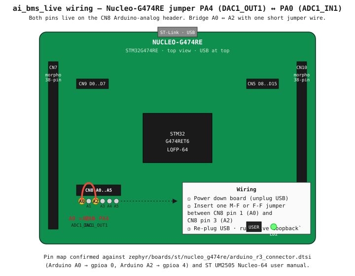

# ai_bms_live

**Live ADC sampling pipeline — DAC1 (PA4) drives a simulated cell
voltage that ADC1 (PA0) reads back at 1 kHz.**

Every other BMS app in this repo runs on flash-baked test windows.
This one demonstrates the **production stream-processing shape**:

```
DAC (PA4) ─jumper─ ADC (PA0)
                    │
                    ▼
              sampler thread (1 kHz, priority 4)
                    │ ring_buf_put
                    ▼
              soc_worker thread (10 Hz, priority 8)
                    │ IIR filter → toy SOC
                    ▼
              shell `live status` reads atomic state
```

This is the same shape a real BMS uses: high-priority ISR/timer for
ADC, lock-free ring buffer to drain to a worker, the worker runs the
heavy math (EKF, ML inference). The toy SOC integrator here would be
replaced by `dual_ekf_step()` from `apps/ai_bms_dual_ekf` in a real
build.

## Wiring

**One short jumper wire between two CN8 pins, two pins apart.**



PA0 and PA4 are both pulled out as **Arduino-analog pins on header
CN8** — no need to go to the morpho headers at all:

| Signal | STM32 pin | Arduino label | CN8 pin |
|--------|-----------|---------------|---------|
| ADC1_IN1 (input) | PA0 | A0 | pin 1 |
| DAC1_OUT1 (output) | PA4 | A2 | pin 3 |

One M-F or F-F jumper wire bridges them. They're 2 pins apart on the
same header. (Verified against
`zephyr/boards/st/nucleo_g474re/arduino_r3_connector.dtsi` —
`ARDUINO_HEADER_R3_A0 → &gpioa 0` and `ARDUINO_HEADER_R3_A2 → &gpioa 4`.)

```
                CN8 (Arduino A0..A5 header)
                ────────────────────────────
                ●  ○  ●  ○  ○  ○
                A0 A1 A2 A3 A4 A5
                ↑     ↑
                │     │
                └──[jumper]──┘
                PA0  PA4
                ADC  DAC
```

After connecting, run `live loopback` to verify ADC reads ≈ DAC output
across four test points.

## Without the jumper

The app still flashes and boots — sampler thread runs, ADC reads a
floating pin (~0 V). `live loopback` will show large errors:

```
DAC = 0.500 V  →  ADC = 0.305 V  (err = -0.195 V)
DAC = 1.000 V  →  ADC = 0.069 V  (err = -0.931 V)
```

That's the smoke test for "did I forget the jumper?"

## With the jumper, four scenarios

```bash
g474> live loopback           # confirms wiring
g474> live simulate sweep     # discharge curve over 30 s
g474> live status             # poll filtered V + toy SOC
g474> live simulate step      # voltage step at t=5 s
g474> live simulate sin       # 0.5 Hz sine
g474> live simulate stop      # hold at 1.5 V (idle)
```

The DAC/ADC range is 0..2.5 V (against the STM32G4's internal 2.5 V
Vref+). We treat that as a "scaled cell voltage" — feel free to wrap
the DAC output through an op-amp or a level shifter to span an actual
2.7..4.2 V cell range.

## Why DAC + ADC instead of an ADC stream?

This app's purpose is to demonstrate **the production architecture**,
not to interface with a real cell. The DAC gives us deterministic,
controllable test signals (sweep / step / sin) that exercise the
sampler + ring buffer + worker pipeline end-to-end. Connecting a real
cell takes a different stack (analog front-end IC like LTC6811 over
SPI), and the BMS architecture above is the same.

To turn this into a real-cell demo:

1. Replace the DAC code with an SPI driver for an AFE chip (or use the
   STM32G4's built-in op-amps to make a divider network).
2. Replace `worker_loop`'s toy IIR with `dual_ekf_step()`.
3. Add multi-cell handling (loop over N cells in `worker_loop`).

The ring buffer + thread layout stays exactly the same.

## Shell commands

| Command | What it does |
|---------|--------------|
| `live loopback`               | Sanity-check the PA4 ↔ PA0 wiring |
| `live simulate <stop\|sweep\|step\|sin>` | Drive DAC with a test waveform |
| `live status`                 | Filtered V + toy SOC + sample stats |

## Footprint

| Region | Used   | %     |
|--------|--------|-------|
| FLASH  | 75 KB  | 15 %  |
| RAM    | 25 KB  | 19 %  |

## Production extensions

1. **DMA-driven ADC** — the current implementation polls ADC in a
   thread, which limits throughput to a few kHz. STM32 ADC + DMA
   captures buffers of N samples per interrupt; thread just drains
   the DMA buffer when it's full.
2. **Multi-channel ADC scan** — real BMS reads V × 16 cells + I + T
   sequentially. STM32G4 supports a regular sequence of up to 16
   channels per ADC, and we have ADC1+ADC2+ADC3+ADC4+ADC5.
3. **ADC calibration** — call `HAL_ADCEx_Calibration_Start()` at boot
   for self-calibration. Skipped here for brevity.
4. **Sample timestamping** — current code uses `k_uptime_get()` (1 ms
   resolution). Production uses STM32 hardware timer + DMA snapshot
   for sub-microsecond sample-to-sample timing accuracy.
